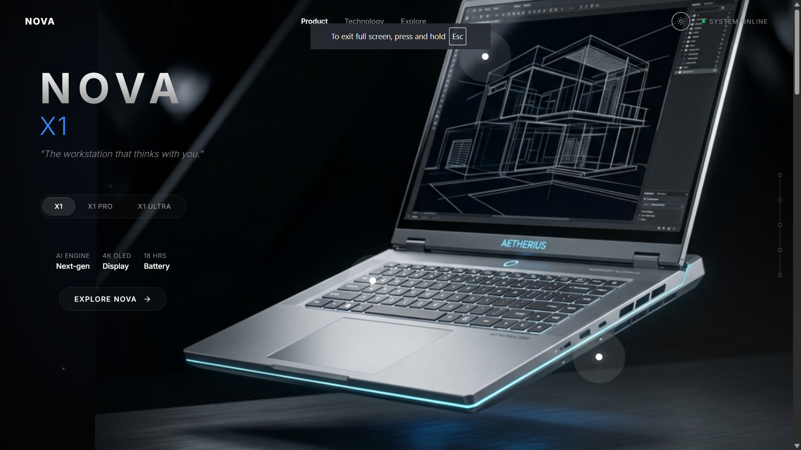

# NOVA — Interactive AI Workstation Showcase

> "The workstation that thinks with you."

## Overview
NOVA is a fictional premium AI workstation showcase designed to demonstrate interactive frontend design, scroll-based animations, immersive product storytelling, and responsive layouts. It highlights modern web capabilities by seamlessly transitioning between product variants and allowing users to explore technical features in a cinematic, dark-themed environment. 

This project was created for the GDG on Campus SRM 2026–27 Technical Domain recruitment task: "Interactive Product Showcase using Framer".

## Live Demo
[https://nova-interactive-showcase.vercel.app](https://nova-interactive-showcase.vercel.app)

## Features
- **Product Variants:** Discover three distinct models (NOVA X1, X1 PRO, X1 ULTRA) dynamically integrated into the showcase.
- **Scroll-Based Storytelling:** Fluid, staged narrative transitions triggered by scroll progression.
- **Interactive 3D Product Depth:** Immersive pointer-tracking depth and parallax effects that bring the product visual to life.
- **Hotspots:** Clickable annotations offering detailed, variant-specific metrics (Neural Engine, Display, Thermal Core).
- **NOVA Intelligence (Workload Advisor):** A deterministic, interactive workload analyzer that recommends the ideal configuration based on user input.
- **Responsive Design:** Optimized for both desktop and mobile screens without sacrificing visual fidelity.
- **Cinematic UI:** A highly polished, dark-mode focused aesthetic featuring smooth typography and restrained micro-animations.

## NOVA Intelligence

The **NOVA Intelligence** section features a local deterministic workload analysis engine. 
*Note: This feature uses a keyword-based evaluation system to calculate metrics; it does not connect to a trained ML model or external APIs.*

- **User Workload Input:** Users describe their tasks in a premium input area.
- **Preset Workloads:** Quick-select options (e.g., AI/ML Training, Video Editing, 3D Rendering) instantly populate and analyze common workflows.
- **Workload Analysis:** Evaluates the input based on keywords to simulate demand across four metrics:
  - GPU Demand
  - Memory Demand
  - Neural Compute
  - Thermal Load
- **Configuration Recommendation:** Suggests the optimal NOVA variant (X1, X1 PRO, or X1 ULTRA) and summarizes the reasoning based on the extracted computational requirements.

## Product Variants

| Feature | NOVA X1 | NOVA X1 PRO | NOVA X1 ULTRA |
|---------|---------|-------------|---------------|
| **Target** | Daily creation & productivity | Creators & technical workflows | Intensive local AI & simulation |
| **Neural Engine** | 20 TOPS | 40 TOPS | 60 TOPS |
| **Unified Memory** | 16 GB | 32 GB | 64 GB |
| **Display** | Holographic Display | Pro Display | Extreme-density Display |
| **Thermal Architecture** | Standard | Precision | Extreme Thermal Core |

## Interactive Experience
- **Scroll Interactions:** As you scroll, the layout effortlessly transitions through the Intro, Technology focus areas, and Final Reveal using calculated progress thresholds.
- **Product Variant Switching:** Instantly toggles product visual effects, hotspot descriptions, and hero text.
- **3D Interaction/Depth:** When using a pointer on a desktop, the product dynamically rotates and a subtle ambient light shifts inversely to simulate depth.
- **Animations & Responsive Behavior:** Utilizes Framer Motion for buttery smooth entrance animations and state changes. The layout stacks elegantly on mobile devices while maintaining comfortable typography and tap targets.

## Tech Stack
- **React 19:** Frontend UI library
- **Framer Motion 13:** Animation library for scroll tracking, layout transitions, and interactive physics
- **TypeScript:** Type-safe development
- **Vite 8:** Lightning-fast build tool and development server
- **Vanilla CSS (Modules):** Encapsulated, flexible styling using CSS variables for a maintainable design system
- **Lucide React:** Minimalist iconography

## Project Structure
```text
src/
├── components/
│   ├── AnimatedBackground/     # Particle background effects
│   ├── ComparisonSection/      # Final spec comparison table
│   ├── Hotspot/ & HotspotInfo/ # Interactive product markers
│   ├── Navigation/             # Top app bar
│   ├── NovaIntelligence/       # AI Workload Advisor feature
│   ├── ProductStage/           # Main scroll-based narrative container
│   ├── ProductVisual/          # 3D interactive product rendering
│   ├── ScrollSequence/         # Scroll tracking wrapper
│   └── VariantSelector/        # Product switcher
├── App.tsx                     # Main layout assembly
├── index.css                   # Global CSS variables and resets
└── main.tsx                    # Entry point
```

## Getting Started

To run the showcase locally on your machine:

1. **Clone the repository:**
   ```bash
   git clone https://github.com/prasidhagarwal-hue/nova-interactive-showcase.git
   cd nova-interactive-showcase
   ```

2. **Install dependencies:**
   ```bash
   npm install
   ```

3. **Start the development server:**
   ```bash
   npm run dev
   ```

4. **Build for production:**
   ```bash
   npm run build
   ```

## Design Philosophy
The visual direction of NOVA is strictly:
- **Cinematic & Futuristic:** Utilizes large, expressive typography and subtle glows.
- **Premium & Minimal:** Prioritizes negative space, avoiding cluttered interfaces and generic UI cards.
- **Technical & Dark-Mode Focused:** High contrast, deep near-black backgrounds accented by restrained brand colors.
- **Restrained Effects:** Uses motion to guide the eye and communicate state without overwhelming the user.

## Screenshots



.png)

.png)

.png)

## Author

**Prasidh Agarwal**
- GitHub: [prasidhagarwal-hue](https://github.com/prasidhagarwal-hue)
